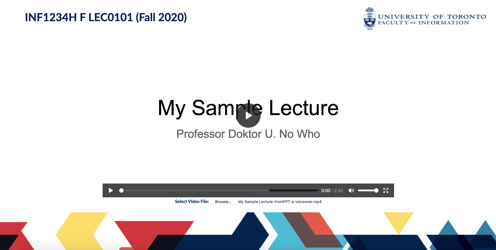

# Browser Video Player
A "quick fix" HTML/CSS/JS player created for sharing video files on screensharing platforms such as Blackboard Collaborate and Zoom for my work at the Faculty of Information, University of Toronto, Canada.

Not optimized for responsiveness.

